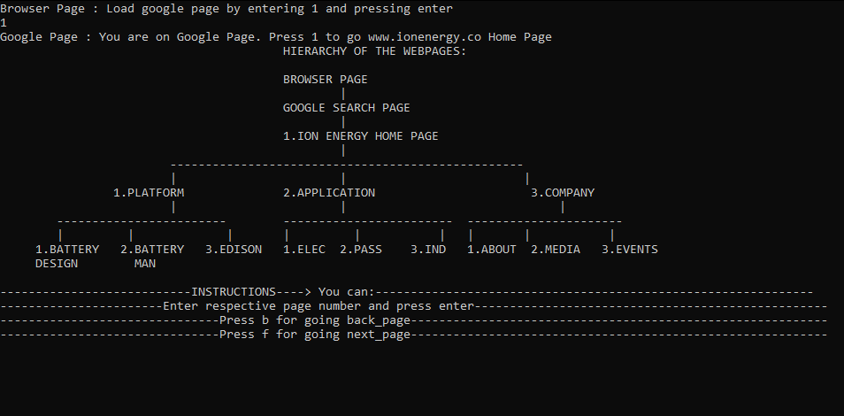

# ION ENERGY TASK

In this task,I have implemented backward and Forward arrow functionality of any standard web browser used to surf back and forth between previously searched pages.

I have used Doubly linked list Data structure. Advantage of using this data structure is that we can have
both previous as well as next node adresses so traversing back and forth is efficient for this task.

## Dependencies for Running Locally

* gcc/g++ >= 5.4
  * Linux: gcc / g++ is installed by default on most Linux distros
  * Mac: same deal as make - [install Xcode command line tools](https://developer.apple.com/xcode/features/)
  * Windows: recommend using [MinGW](http://www.mingw.org/)

## Basic Build Instructions

1. Clone this repo.
2. g++ -o output main.cpp
3. Run it: `./output`.cpp 
